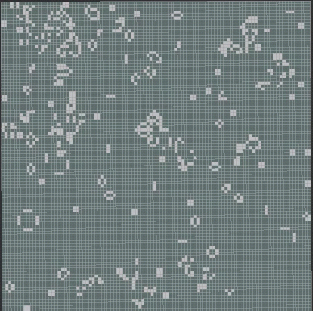

# ROS2 Game of Life
This project implements [Conway's Game of Life](https://en.wikipedia.org/wiki/Conway%27s_Game_of_Life) as a ROS 2 node with visualization provided by RVIZ2. The cellular automaton is implemented using an occupancy-grid that is updated and published by a ROS 2 node on each generation, i.e., **tick**. The project is implemented using TypeScript, Node.js and the [rclnodejs](https://github.com/RobotWebTools/rclnodejs) ROS 2 client library.



## Prerequisites
* [git](https://git-scm.com/)
* [Node.js](nodejs.org) ver. 12 and either npm or yarn package manager
* [ROS 2 Foxyfitzroy distribution](https://index.ros.org/doc/ros2/Installation/Foxy)


## Installation and Running
From a command shell run the commands shown in the following steps.

### Step-1 Clone ros2_js_examples github repository
```
git clone https://github.com/ros2jsguy/ros2_js_examples.git
```
You should see the project code downloaded to a new directory named `ros2_js_example.

### Step-2 Install Project Dependencies
```
cd ros2_js_examples
npm install
```
This may take 1-2 minutes to complete as the rclnodejs package must be compiled as part of the installation process.
### Step-3 Run TypeScript Compiler
```
npm run build
```
### Step-4 Run Game-of-Life
```
npm run game_of_life
```
or 
```
npm run example4
```
This step will start two processes: the GameOfLife ROS 2 node process and the rviz2 visualization process. When the rviz2 UI appears it should begin display of an occupancy-grid that is updated twice per second (2 hz). Additionally the ros node will output to stdout the current generation number and number of alive cells.

## Implementation Notes

At startup a ROS 2 node named `/ros2_js_examples/game_of_life_node` is created. This node then creates a Publisher for `nav_msgs/msg/OccupancyGrid` messages. Additionally the node creates a Timer instance which defines the frequency at which life generations (ticks) are computed. During a `tick()` operation the life rules are applied to the previous occupancyGrid state to create a new OccupancyGrid message. The occupancyGrid message is then published by the internal publisher on the topic: `game_of_life`. OccupancyGrid messages use the frame_id `game_of_life_frame`. Once started the process runs until there are no cells alive. As a result the program may run for long periods when it reaches a steady state of alive cells. 


## Future Plans
Some upcoming enhancements include:
* Externalize parameters for customizing the grid size, resolution and rate (tick hz) of evolution.
* Detect steady states scenarios.
